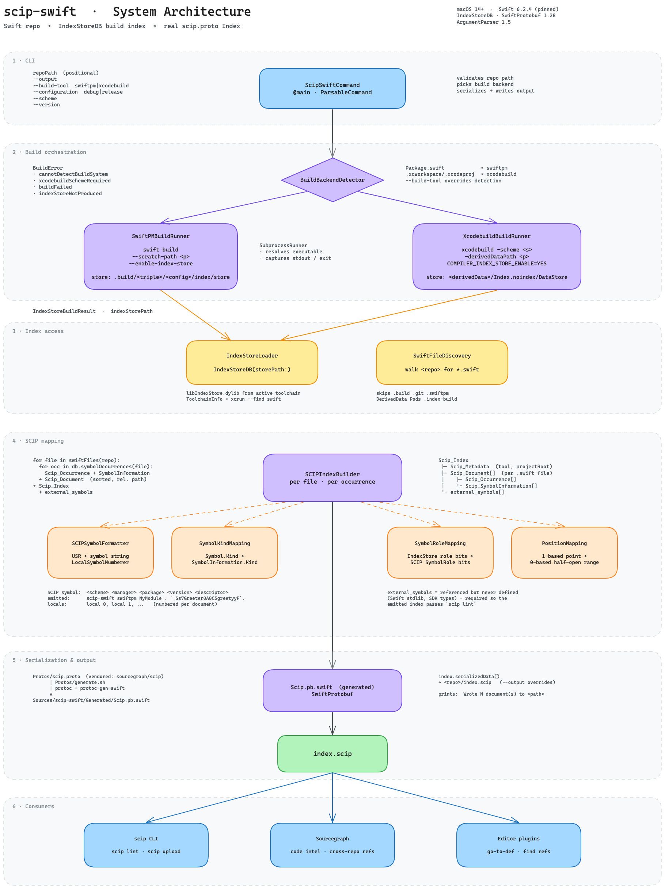

<!-- generated-by: gsd-doc-writer -->
# scip-swift

A [SCIP](https://github.com/sourcegraph/scip) indexer for Swift. It converts a Swift repo's build
index into genuine `scip.proto` output — real protobuf `Index`/`Document`/`Symbol`/`Occurrence`
messages, consumable by any standard SCIP tool (the `scip` CLI, `codeintel`, Sourcegraph, editor
plugins) — by reading the same [IndexStoreDB](https://github.com/swiftlang/indexstore-db) index
that powers Xcode's own "jump to definition" and SourceKit-LSP.

## How it works

1. `scip-swift` builds your repo with indexing-while-building enabled:
   - SwiftPM repos: `swift build --enable-index-store`
   - Xcode-project repos: `xcodebuild ... COMPILER_INDEX_STORE_ENABLE=YES`
2. It reads the resulting IndexStore via `IndexStoreDB`'s `SymbolOccurrence` query API.
3. It maps each occurrence to a SCIP `Occurrence`/`SymbolInformation` — including symbol
   relationships (overrides), role bits, and minimal signatures — and emits a `.scip` file.

## Architecture



See [docs/system-architecture.md](docs/system-architecture.md) for the component-by-component
breakdown.

## Install

macOS 14 (Sonoma) or later is required.

Homebrew:

```sh
brew install phuongddx/scip-swift/scip-swift
```

Or build from source (requires a Swift toolchain matching the pinned version in
`.swift-version`):

```sh
git clone https://github.com/jarvis-intelligence/scip-swift.git
cd scip-swift
swift build -c release
cp .build/release/scip-swift /usr/local/bin/
```

Prebuilt universal binaries (arm64 + x86_64) are attached to each
[GitHub release](https://github.com/jarvis-intelligence/scip-swift/releases).

## Usage

```sh
scip-swift /path/to/your/swift/repo
# writes /path/to/your/swift/repo/index.scip
```

The `index` subcommand is equivalent — useful for tools that always pass an explicit subcommand
name (`index` is also `scip-swift`'s `defaultSubcommand`, so the bare form above dispatches to it):

```sh
scip-swift index /path/to/your/swift/repo --output /path/to/output.scip
```

Options:

| Flag | Meaning |
|---|---|
| `--output <path>` | Where to write the `.scip` file (default: `<repo>/index.scip`) |
| `--build-tool swiftpm\|xcodebuild` | Override auto-detection (`Package.swift` → swiftpm, `.xcodeproj`/`.xcworkspace` → xcodebuild) |
| `--configuration debug\|release` | Forwarded to the underlying build tool (default: `debug`) |
| `--scheme <name>` | Xcode scheme to build (only for `xcodebuild`; auto-detected if the project has exactly one scheme) |
| `--cache-dir <path>` | Directory for the incremental index cache (default: `<repo>/.scip-cache`). Passing this flag enables the persistent cache |
| `--index-only` | Skip the build step and read an existing IndexStore directly (from the cache directory) |
| `--version` | Print the converter version and the Swift toolchain version it was built against |

### Indexing multiple repos

`index-many` indexes two or more repos independently, writing one `.scip` per repo or merging
them into a single index:

```sh
# one .scip per repo, written to --output-dir (default: current directory)
scip-swift index-many /path/to/repoA /path/to/repoB --output-dir out/

# merge into a single index (default: ./merged.scip)
scip-swift index-many /path/to/repoA /path/to/repoB --merge --merged-output combined.scip
```

`index-many` supports `--configuration` and `--cache-dir` as well.

### Incremental indexing

Passing `--cache-dir` (or `--index-only`) switches the pipeline from a throwaway temp directory
to a persistent cache:

- Unchanged files reuse their previously computed `Scip_Document` (keyed by the composite of
  the file's relative path and its SHA256 content hash), so re-indexing after small edits only
  reprocesses what changed.
- The cache is invalidated wholesale when the Swift toolchain version, `scip-swift` version,
  indexstore-db revision, build backend, or the emitted symbol format version
  (`symbolFormatVersion`, currently 3 — format 1 is the raw-USR era, format 2 the canonical
  descriptor-chain scheme with content-hash cache keys, format 3 composite
  path+content-hash cache keys) changes (recorded in `manifest.json`). A manifest that fails
  to decode — e.g. written by an older engine without
  the current fields — is treated as no manifest: the cache is discarded wholesale, so
  old-format caches never mix with new-format output.
- The index builder additionally fingerprints the overload table (SHA-256 over each overload
  group's identity and its source-ordered member USRs) as a global cache-validation key:
  overload indices `(+N)` depend on every group member repo-wide, so any overload change
  anywhere — even in files whose own content did not change — invalidates cached documents.
  This granularity is deliberately conservative (any overload edit invalidates everything);
  a per-group precise refinement is a recorded v2 follow-up.
- Each cached document is accompanied by `docs/<key>.usrmap`, a canonicalSymbol → USR side map
  for raw-USR fallback symbols, so external display names demangle identically on fresh and
  cache-hit runs. It rides the same composite (relativePath, content hash) key as its
  `.scipdoc` and invalidates atomically with it. The `.scipdoc`/`.usrmap` keys are composite by
  design — SHA-256 over `relativePath || 0x00 || contentHash` — so two byte-identical files
  never share a cache entry and a renamed file misses naturally and rebuilds; a format bump
  (e.g. to the current `symbolFormatVersion` 3) wholesale-invalidates older caches via the
  manifest gate.
- `--index-only` reuses the already-built IndexStore under the cache directory (it does not
  rebuild), so it fails with `indexStoreNotFoundForIndexOnly` if no prior indexed build exists
  there.

### Determinism

Indexing the same store twice is byte-identical, regardless of cache state:

- Occurrences are ordered by the canonical SCIP rules (ascending by range start, then range
  end, then symbol string) and deduplicated on (symbol, range, roles); documents ascend by
  relative path and document symbols by symbol string.
- `ToolInfo` metadata never embeds raw command-line arguments (they would differ between two
  CLI runs with different `--output` paths, and they leak local paths into shared artifacts).
  The one synthetic entry it does carry is the constant `scip-cli-version=<pin>` (the scip CLI
  version the output is gated against).

### The `scip` CLI gate

Every emitted fixture index is validated by the real `scip` CLI from
[scip-code/scip](https://github.com/scip-code/scip) — the same tool consumers run — via the
`ScipCLIGate` suite (`Tests/scip-swiftTests/ScipCLIGateTests.swift`):

- `scip lint` on the MiniSwiftPackage and SchemeFixture indexes must exit 0 with zero
  `error:` findings.
- `scip snapshot --strict=false` output for the SchemeFixture index is diffed against the
  committed goldens in `Tests/scip-swiftTests/SchemeFixtureGoldens/` (the CLI has no verify
  mode; the test harness owns the directory diff).
- The gating binary's version is cross-checked against `ScipSwiftVersion.scipCliVersion` —
  drift between the CI pin and the engine constant fails the suite.

Environment variables the gate understands:

| Variable | Effect |
| --- | --- |
| `SCIP_BIN` | Path to the `scip` binary (CI sets this to the checksum-verified pinned download; without it the binary must be on `PATH`). When neither resolves, the gate tests FAIL with install guidance — they never silently skip. |
| `UPDATE_GOLDENS=1` | Regenerate the committed snapshot goldens instead of diffing (use after an intentional emission change). |
| `UPDATE_SYMBOL_TABLE=1` | Regenerate `Fixtures/SchemeFixture/symbol-table.json` (see the cross-repo parity check below). |

CI downloads the pinned CLI tarball from the scip-code/scip GitHub release over HTTPS,
verifies it against the release-published `.sha256` sidecar (a mismatch fails the job), and
caches it keyed by `SCIP_CLI_VERSION` so an unchanged pin skips the download. `SCIP_CLI_VERSION`
(in `.github/workflows/ci.yml`) is the single pin and must match `ScipSwiftVersion.scipCliVersion`.
CI also builds and tests under the pinned Swift toolchain — selected via `XCODE_PIN` and verified
fail-loud by the workflow's select step plus the in-suite `ToolchainDriftGuard` test.

## macOS-host requirement

Indexing any repo that imports Apple-platform-only frameworks (`UIKit`, `WatchKit`, `WidgetKit`)
requires a macOS host with Xcode and the relevant SDKs — Apple does not ship the iOS SDK for Linux.
Pure Swift-package code without those imports can build (and be indexed) on Linux, but that's not
the common case for a real iOS app repo. If the underlying build command fails for this reason,
`scip-swift` surfaces it as a build failure rather than silently producing a partial index.

## Known limitations

- **Canonical descriptor symbols, raw-USR fallback**: `Scip_SymbolInformation.symbol` is a
  canonical descriptor chain (`scip-swift swiftpm MyMod . Shape#resize(+1).`) parsed straight from
  the compiler's USR — never derived from the demangler, which stays display-only. A USR the
  parser cannot handle (exotic substitutions, parameters, malformed input) falls back to the raw
  USR as a single escaped Term under the canonical module header; each run prints how many
  symbols took that fallback. Known carried-forward scheme limitations (frozen with the Phase-1
  spec):
  - **Term-family retroactive collisions cannot carry `(+N)`** — the SCIP grammar allows
    disambiguators only on Method descriptors, so retroactive property/let/case collisions
    across declaring modules render the same string.
  - **A getter and a zero-arg method of the same name collapse to one `SymbolInformation`**
    (they render the identical string); the surviving Kind is the definition last in source
    order.
  - **Parameters take the raw-USR fallback** — their canonical form needs enclosing-function
    container parsing, planned for a later phase.
- **Occurrence ranges**: IndexStoreDB (like the underlying IndexStore format) only records a
  single anchor point per occurrence — not a start/end range. The end column is the exact
  identifier-token extent from a `SwiftSyntax` parse of the file; the name-length approximation
  remains only as a fallback for regions the parser cannot recover (e.g. severely malformed
  syntax). Statically linking `SwiftSyntax`/`SwiftParser` grows the release binary from ~7 MB to
  ~24.5 MB — an accepted trade-off for this milestone (compiler-grade token extents without
  shipping a separate parser binary).
- **No call-hierarchy role**: real `scip.proto`'s `SymbolRole` enum has no call-specific bit; call
  sites are marked with the same `ReadAccess`/`WriteAccess` roles as any other reference.
- **Minimal signatures**: reconstructed signatures carry the symbol name but lack parameter and
  return types — IndexStoreDB's symbol data doesn't expose them.
- **Relationships limited to overrides**: only override relationships are mapped; IndexStoreDB's
  relation data doesn't cover the full SCIP relationship set.
- **USR stability across toolchain versions is not guaranteed by Apple — golden
  reproducibility is toolchain-pinned.** This project pins the Swift toolchain version it's
  built and tested against (see `.swift-version`); indexing with a different toolchain
  version may be fine in practice but isn't a supported/tested configuration. Concretely:
  Swift Testing synthesized accessor USRs carry toolchain-dependent hash suffixes, and newer
  toolchains emit extra stdlib interpolation occurrences
  (`DefaultStringInterpolation.appendLiteral`/`appendPart`) — both observed when a Swift 6.3.3
  runner built indexes against 6.2.4-generated goldens. The committed snapshot goldens under
  `Tests/scip-swiftTests/SchemeFixtureGoldens/` are therefore reproducible ONLY under the
  `.swift-version` pin; CI enforces it (selecting the pinned Xcode via `XCODE_PIN` and failing
  loudly on drift, plus an in-suite toolchain drift guard), so a red golden diff on a
  different toolchain is environment drift, not a regression. To change the pin: switch to
  the new toolchain (`xcode-select` or `DEVELOPER_DIR`), update `.swift-version` +
  `ToolchainInfo.pinnedSwiftVersion` + the workflow pin pair (`SWIFT_TOOLCHAIN_PIN`/
  `XCODE_PIN` in `.github/workflows/ci.yml`), and regenerate the goldens intentionally with
  `UPDATE_GOLDENS=1` under the new toolchain.

## Development

```sh
swift build
swift test
```

Regenerating the vendored SCIP protobuf bindings (only needed if `Protos/scip.proto` is updated
from upstream `sourcegraph/scip`):

```sh
brew install protobuf swift-protobuf
Protos/generate.sh
```

## License

Apache-2.0 — see [LICENSE](LICENSE).
